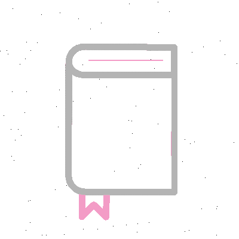
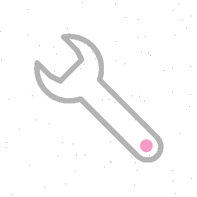
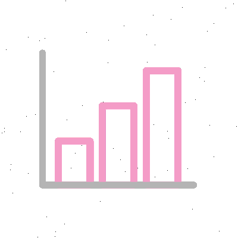

<h1 align="center">Hi guys  i'm Pierre RICARD</h1>
<h3 align="center">Fullstack web developer with Javascript</h3>


<br>

<hr>

<p align="center">  </p>

<p align="center"> <a href="https://twitter.com/pierrericard47" target="blank"></a> </p>

<p align="center"> <a href="https://github.com/ryo-ma/github-profile-trophy"></a> </p>

<hr>

<br>

## About me 


<br>

-   🌱 I’m always learning **Javascript frameworks (front & back) and >> REACT.**

-   I was a student in this academy : [O'Clock](https://oclock.io/) 

-   📝 I regularly read articles on [https://blog.webdevsimplified.com/](https://blog.webdevsimplified.com/)

-   How to reach me **ricardpierre@protonmail.com** 

-   ⚡ Fun fact **I've been a firefighter for more than 8 years !**

<br>

## Connect with me on 

<br>
<br>

<p align="left" width="50%">
Twitter :
<a href="https://twitter.com/pierrericard47" target="blank"> </a>
LinkedIn :
<a href="https://linkedin.com/in/pierre-ricard-" target="blank"></a>
</p>

<br>

## My current projects 

<br>

[](https://github.com/Pierre747/Meme-Generator)
[](https://github.com/Pierre747/Cooking-With-React)
[](https://github.com/Pierre747/Aggregate)
[](https://github.com/Pierre747/integration-HTML-responsive)
<br>

## Languages spoken 

<p align="center"> 
</p>

<br>
<br>

|                                                               |                                                              |                                                            |
| -------------------------------------------------------------------------- | ------------------------------------------------------------------------- | ------------------------------------------------------------------------- |
|  |  |  |

<br>

## Technical skills 

<br>

<h2 align="left">Front-End</h2>

<p align="left">
<a href="https://reactjs.org/" target="_blank" rel="noreferrer">  </a> <a href="https://www.w3schools.com/css/" target="_blank" rel="noreferrer">  </a> <a href="https://www.w3.org/html/" target="_blank" rel="noreferrer">  </a> <a href="https://developer.mozilla.org/en-US/docs/Web/JavaScript" target="_blank" rel="noreferrer">  </a> <a href="https://www.linux.org/" target="_blank" rel="noreferrer"></a> <a href="https://www.typescriptlang.org/" target="_blank" rel="noreferrer">  </a> </p>

<h2 align="center">Back-End</h2>
<p align="center">
<a href="https://www.npmjs.com/" target="_blank" rel="noreferrer">  </a>
<a href="https://expressjs.com" target="_blank" rel="noreferrer">  </a>
 <a href="https://postman.com" target="_blank" rel="noreferrer">  </a>
<a href="https://sequelize.org/"> </a> <a href="https://nodejs.org" target="_blank" rel="noreferrer">  </a> <a href="https://www.postgresql.org" target="_blank" rel="noreferrer">  </a> <a href="https://www.npmjs.com/" target="_blank" rel="noreferrer"> </p> </a>
 <h2 align="right">Else</h2>
<p align="right">
 <a href="https://www.markdownguide.org/"> </a>
<a href="https://www.gnu.org/software/bash/" target="_blank" rel="noreferrer">  </a>
<a href="https://www.figma.com/" target="_blank" rel="noreferrer">  </a>
 <a href="https://www.photoshop.com/en" target="_blank" rel="noreferrer">  <a href="https://git-scm.com/" target="_blank" rel="noreferrer">  </a> </a> 
</p>

<br>

## GitHub Analytics 

<br>

```JS
async function revealPierreRealWorkOnGithub() {
    const showMeDatSkills = await findAll(BadassStatApp);
};
console.log(revealPierreRealWorkOnGithub); //undefined (⌣̩̩́_⌣̩̩̀)
```

<br>


<br>
<p align="right"> 
</p>


<br>


